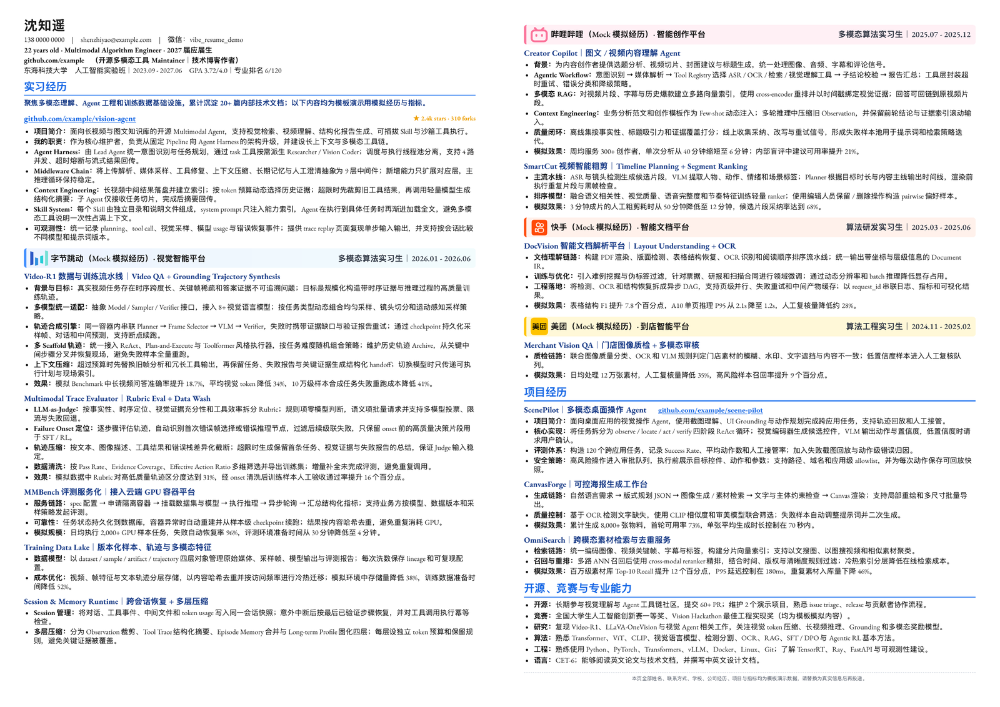

# Dense Two-Page · 高密度双页技术简历模板

这个模板适合内容较多的算法、AI Agent、基础设施和全栈技术候选人。视觉风格以白底、高密度正文、蓝色章节标题、细分隔线和带 Logo 的浅色经历标题条为核心。



## 使用

> **重要：**浏览器只用于预览模板，不用于生成最终 PDF。不要交付浏览器“打印 / 另存为 PDF”的文件；正式 PDF 必须使用本项目官方导出脚本。

在仓库根目录运行：

```bash
npm install
npm run export:pdf:dense-two-page
```

输出文件：

```text
export/vibe-resume-dense-two-page-demo.pdf
```

也可以直接使用通用导出脚本：

```bash
./export-pdf.sh export/my-resume.pdf templates/internship-employment/dense-two-page/index.html
```

## 一页 / 两页兼容

- 默认包含两个 `.resume-page`，导出为两页。
- 内容较少时，删除第二个 `.resume-page`，导出器会自动生成一页 PDF。
- 不要让内容溢出固定页面；应优先删减内容，其次微调字号和间距。

## Logo

Logo 是可选项。需要公司 Logo 时，Agent 应先建议用户打开 [Iconfont](https://www.iconfont.cn/) 手动搜索、核对并下载 SVG，再把文件交给 Agent 放入 `assets/logos/`。也可优先使用公司官方品牌素材库。如果是 AI 模型、产品或供应商图标，则按 [LobeHub Icons 官方 Agent 指南](https://lobehub.com/icons/skill.md) 和 `@lobehub/icons` 流程获取。所有正式简历都只引用本地文件，不热链。

此示例中，字节跳动、快手和美团使用用户从 Iconfont 手动下载后提供的 SVG；哔哩哔哩使用 `Bilibili.Color`。公司栏底色和左侧强调色必须与选定 Logo 主色呼应。四家经历均为 `Mock 模拟经历`。

Logo 必须透明直贴，不要添加白色底座、白边、额外描边或装饰圆角。不同 SVG 的画布留白不同，因此要逐枚按视觉大小校准，而不是机械统一宽高：实际图形应约占 44px 公司栏的 75%–80%，当前显示盒约为 35–39px；应保持 SVG 原始比例，不拉伸、不裁切。

模板中的姓名、联系方式、学校、公司经历、项目和指标全部为模拟内容。公司名称及 Logo 仅作样式演示，不代表真实经历。

## 字体与密度

- 参考尺度为 A3 竖版（导出尺寸 1122 × 1588 CSS px，约 841.5 × 1191 pt）：正文 12pt、姓名约 22.5pt、章节标题 18pt、项目与公司标题 13.5–15pt。
- 正文使用 PingFang SC + 本地嵌入的 EB Garamond，不要随意替换成纯黑体或纯宋体，也不要在没有正式导出校验的情况下调大字号。
