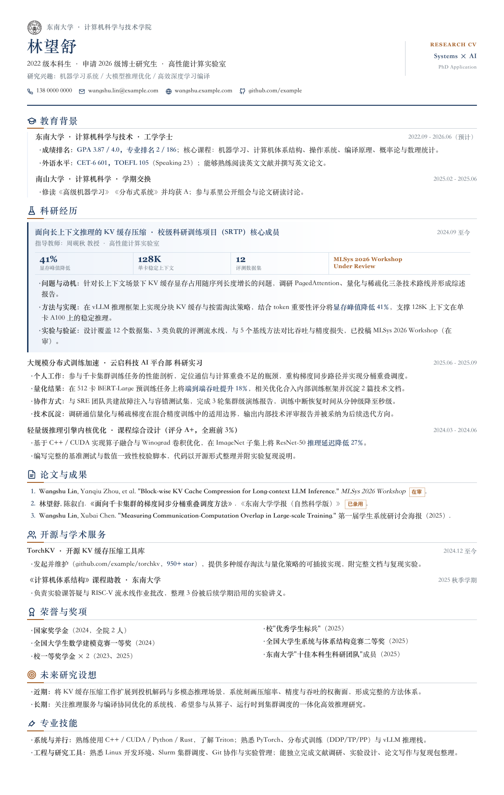

# Research Classic · 科研申请简历模板



面向博士申请、科研实习和研究助理投递的单页长页模板。它将代表性研究工作、论文状态和可验证结果置于更显眼的位置，适合快速说明研究问题、方法、证据和未来方向。

所有人名、院校、实验室、论文、成绩、奖项、数字和链接均为 mock 演示内容。使用前必须替换为真实信息，并删除不适用的模块。

## 使用

在仓库根目录运行：

```bash
npm install
npm run export:pdf:research-classic
```

输出文件：

```text
export/vibe-resume-research-classic-demo.pdf
```

模板默认使用连续长页导出，避免为了固定 A4 而压缩论文题目、研究方法或实验细节。若投递渠道明确要求 A4，请先删减内容，再通过官方导出器重新检查布局。

## 内容取舍

- 首个科研条目应放最具代表性的工作，并补全问题、方法和证据三类信息。
- 论文优先保留第一作者、已发表、已录用或在审的成果；统一标注发表状态。
- “未来研究设想”适合博士套磁版本；科研实习或通用申请版本可以删除，把空间留给论文与研究结果。
- 校徽、照片和外部链接均为可选项。当前东南大学（SEU）校徽仅为示例，请自行准备并上传你的学校校徽，或删除 `school-emblem` 图片元素；不要将示例校徽误认为真实学校归属。
